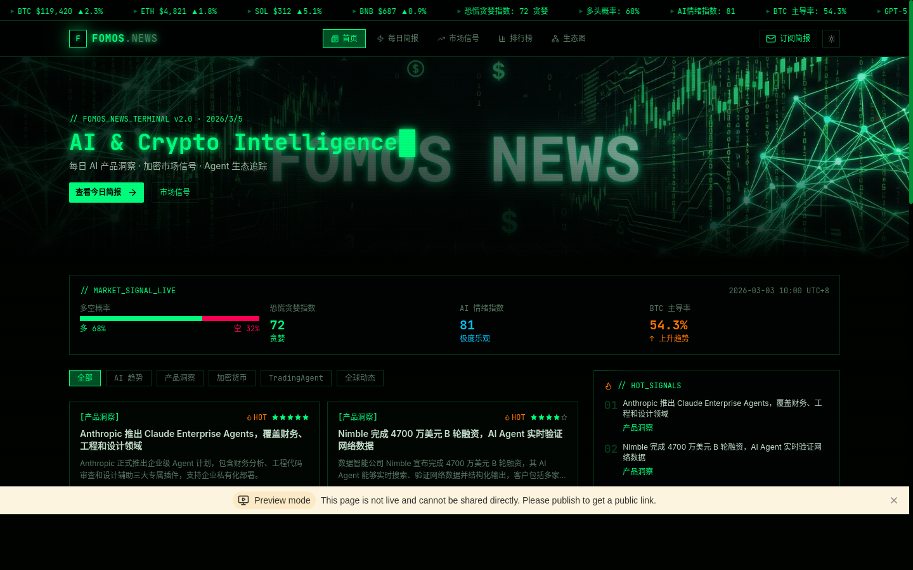
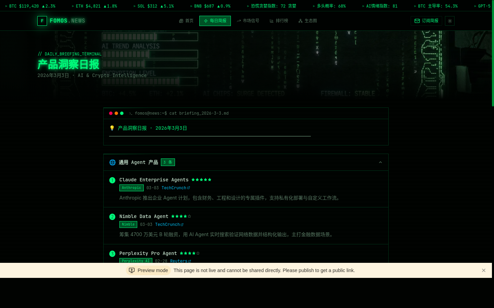
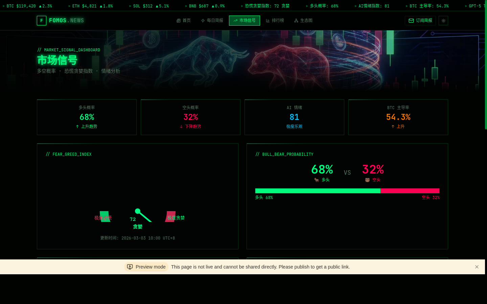
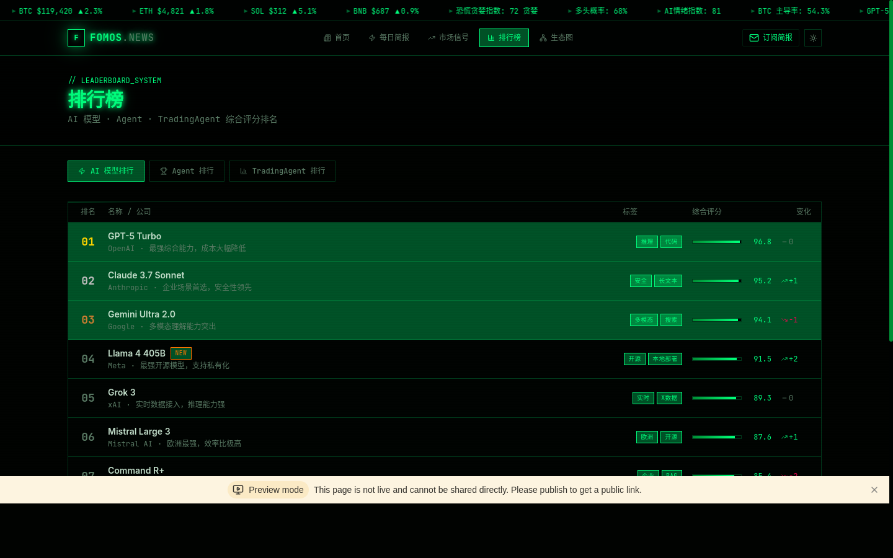
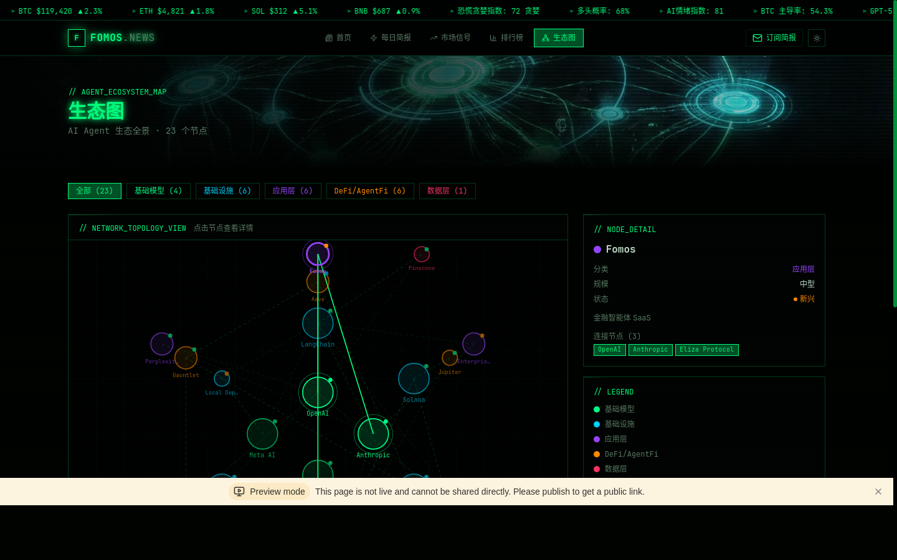

# Fomos News — 完整设计稿

> **Neural Cyberpunk Design System v1.0**
> AI & Crypto Intelligence Platform · 2026

---

## 目录

1. [设计哲学](#1-设计哲学)
2. [颜色系统](#2-颜色系统)
3. [字体系统](#3-字体系统)
4. [间距与圆角](#4-间距与圆角)
5. [核心组件规范](#5-核心组件规范)
6. [动效系统](#6-动效系统)
7. [页面设计稿](#7-页面设计稿)
   - [7.1 首页](#71-首页)
   - [7.2 每日简报](#72-每日简报)
   - [7.3 市场信号](#73-市场信号)
   - [7.4 排行榜](#74-排行榜)
   - [7.5 生态图](#75-生态图)
8. [响应式断点](#8-响应式断点)
9. [图标规范](#9-图标规范)
10. [明暗模式对照](#10-明暗模式对照)

---

## 1. 设计哲学

**设计运动：神经赛博朋克（Neural Cyberpunk）**

Fomos News 的界面设计以神经网络信号流动为核心隐喻，将金融数据的实时性与黑客终端的视觉美学融为一体。界面模拟多屏监控系统，以霓虹绿作为"激活信号"在深黑背景上传递信息，每一个数字跳动都像神经元在放电。

**四大核心原则：**

**信号即内容** — 所有 UI 元素都是信息载体，没有纯装饰性组件。扫描线、光点流动、边框动画均承载"系统运行中"的语义。

**终端美学** — 等宽字体 JetBrains Mono 用于所有数据展示，`//` 注释前缀标识模块，`fomos@news:~$` 命令行提示符出现在简报页，强化黑客终端感。

**不对称监控布局** — 首页采用左侧新闻流 + 右侧实时信号的双栏结构，模拟交易员多屏工作台，而非传统博客的居中单栏。

**色彩即语义** — 霓虹绿 `#00FF88` 代表多头/积极信号，赛博红 `#FF3366` 代表空头/警告，赛博蓝 `#00D4FF` 代表数据/中性，赛博橙 `#FF8C00` 代表新兴/BTC。

---

## 2. 颜色系统

所有颜色使用 OKLCH 色彩空间定义，以保证跨设备色彩一致性。

### 2.1 品牌主色

| Token | OKLCH | HEX 近似值 | 用途 |
|-------|-------|-----------|------|
| `--neon` (暗) | `oklch(0.88 0.28 155)` | `#00FF88` | 主色调、霓虹绿、多头信号 |
| `--neon` (亮) | `oklch(0.38 0.18 155)` | `#006633` | 亮模式主色 |
| `--neon-dim` | `oklch(0.55 0.20 155)` | `#00AA55` | 次级绿色、滚动条 |
| `--neon-glow` | `oklch(0.88 0.28 155 / 0.3)` | `rgba(0,255,136,0.3)` | 发光效果、卡片悬停背景 |

### 2.2 语义色彩

| Token | OKLCH | HEX 近似值 | 语义 |
|-------|-------|-----------|------|
| `--cyber-red` | `oklch(0.65 0.28 15)` | `#FF3366` | 空头、警告、下跌 |
| `--cyber-blue` | `oklch(0.75 0.18 220)` | `#00D4FF` | 数据、链接、中性 |
| `--cyber-orange` | `oklch(0.72 0.22 60)` | `#FF8C00` | BTC、新兴、强调 |

### 2.3 背景层级（暗模式）

| Layer | Token | OKLCH | 用途 |
|-------|-------|-------|------|
| L0 最深 | `--terminal-bg` | `oklch(0.07 0.015 155)` | 终端背景、代码块 |
| L1 | `--panel-bg` | `oklch(0.10 0.015 155)` | 面板背景 |
| L2 | `--background` | `oklch(0.085 0.015 155)` | 页面背景 |
| L3 | `--card` | `oklch(0.11 0.015 155)` | 卡片背景 |
| L4 | `--secondary` | `oklch(0.14 0.015 155)` | 次级面板 |

### 2.4 图表配色

图表使用五色系统，按优先级排列：

| 变量 | 颜色 | 用途 |
|------|------|------|
| `--chart-1` | 霓虹绿 | 主数据线、多头 |
| `--chart-2` | 赛博红 | 对比数据、空头 |
| `--chart-3` | 赛博蓝 | 第三数据系列 |
| `--chart-4` | 赛博橙 | 第四数据系列 |
| `--chart-5` | 暗绿 | 辅助/历史数据 |

---

## 3. 字体系统

### 3.1 字体配对

| 角色 | 字体 | 来源 | 用途 |
|------|------|------|------|
| **显示字体** | JetBrains Mono | Google Fonts | 标题、数字、数据、代码 |
| **正文字体** | Inter | Google Fonts | 新闻正文、描述、UI 文本 |
| **系统回退** | `system-ui, monospace` | 系统 | 降级方案 |

### 3.2 字体层级

| 级别 | 字体 | 大小 | 字重 | 行高 | 用途 |
|------|------|------|------|------|------|
| Display | JetBrains Mono | `2rem–3rem` | 700 | 1.1 | Hero 标题、页面大标题 |
| H1 | JetBrains Mono | `1.5rem` | 700 | 1.2 | 页面标题 |
| H2 | JetBrains Mono | `1.125rem` | 600 | 1.3 | 模块标题 |
| Terminal | JetBrains Mono | `0.85rem` | 400 | 1.6 | 注释、标签、数据 |
| Body | Inter | `0.875rem` | 400 | 1.6 | 新闻正文 |
| Caption | Inter | `0.75rem` | 400 | 1.4 | 时间戳、来源 |
| Badge | JetBrains Mono | `0.7rem` | 400 | 1 | 数据徽章 |

### 3.3 特殊文本效果

```css
/* 霓虹发光文字 */
.neon-text {
  color: var(--neon);
  text-shadow: 0 0 8px var(--neon), 0 0 20px var(--neon-glow);
}

/* 光标闪烁（终端效果） */
.cursor-blink::after {
  content: '█';
  animation: cursor-blink 1s step-end infinite;
  color: var(--neon);
}
```

---

## 4. 间距与圆角

### 4.1 间距系统

Fomos News 使用 Tailwind 4 默认间距系统（基于 0.25rem = 4px 单位），关键间距如下：

| 用途 | 值 | Tailwind 类 |
|------|-----|------------|
| 组件内边距（紧凑） | 8px | `p-2` |
| 组件内边距（标准） | 12px | `p-3` |
| 组件内边距（宽松） | 16px | `p-4` |
| 卡片间距 | 24px | `gap-6` |
| 页面节间距 | 24–32px | `py-6 / py-8` |
| 容器最大宽度 | 1400px | `.container` |

### 4.2 圆角

赛博朋克风格偏向**直角或极小圆角**，强调机械感：

| Token | 值 | 用途 |
|-------|-----|------|
| `--radius` | `0.25rem (4px)` | 全局基础圆角（极小） |
| `--radius-sm` | `0px` | 按钮、徽章（直角） |
| `--radius-md` | `2px` | 输入框 |
| `--radius-lg` | `4px` | 卡片 |

---

## 5. 核心组件规范

### 5.1 Cyber Panel（赛博面板）

所有内容区块的基础容器，带顶部扫描线动画。

```
┌─────────────────────────────────────┐  ← 顶部扫描线（动画）
│ // MODULE_IDENTIFIER                │  ← 终端注释标题
│                                     │
│  内容区域                            │
│                                     │
└─────────────────────────────────────┘
```

**CSS 规范：**
- 背景：`var(--panel-bg)` = `oklch(0.10 0.015 155)`
- 边框：`1px solid var(--panel-border)` = `oklch(0.88 0.28 155 / 0.2)`
- 顶部扫描线：`linear-gradient(90deg, transparent, var(--neon), transparent)` 3s 无限循环
- 圆角：`0`（直角）

### 5.2 Neon Card（霓虹卡片）

新闻条目的容器，悬停时边框发光。

**状态规范：**

| 状态 | 边框颜色 | 阴影 |
|------|---------|------|
| 默认 | `var(--panel-border)` | 无 |
| 悬停 | `var(--neon)` | `0 0 12px var(--neon-glow), inset 0 0 12px var(--neon-glow)` |
| 过渡 | `border-color 0.3s, box-shadow 0.3s` | — |

### 5.3 Data Badge（数据徽章）

用于分类标签、公司名称、状态标识。

```
┌──────────┐
│  标签文字  │  ← JetBrains Mono 0.7rem, 1px neon border
└──────────┘
```

**规范：**
- 字体：JetBrains Mono, 0.7rem
- 内边距：`0.1rem 0.4rem`
- 边框：`1px solid var(--neon)`
- 颜色：`var(--neon)`
- 背景：`var(--neon-glow)`
- 字间距：`0.05em`

### 5.4 Ticker Tape（行情滚动条）

页面顶部的实时数据滚动条，40s 无限循环。

**布局：**
- 高度：`28px`
- 背景：`var(--terminal-bg)`
- 边框底部：`1px solid var(--panel-border)`
- 文字：JetBrains Mono, 0.7rem
- 动画：`ticker 40s linear infinite`，悬停暂停

**数据格式：**
```
▸ BTC $119,420 ▲2.3%  ▸ ETH $4,821 ▲1.8%  ▸ 恐慌贪婪指数: 72 贪婪
```

### 5.5 Navigation Bar（导航栏）

**结构：**
```
┌─────────────────────────────────────────────────────┐
│ [F] FOMOS.NEWS │ 首页 每日简报 市场信号 排行榜 生态图 │ 订阅简报 ☀/🌙 │
└─────────────────────────────────────────────────────┘
```

**规范：**
- 高度：`52px`
- 背景：`var(--background) / 95%` + `backdrop-filter: blur(12px)`
- Logo 字体：JetBrains Mono Bold
- Logo 前缀方块：`12×12px`，`var(--neon)` 背景，`var(--background)` 文字
- 活跃导航项：`var(--neon)` 背景，`var(--background)` 文字，`1px solid var(--neon)` 边框
- 悬停：`var(--neon-glow)` 背景
- 订阅按钮：`1px solid var(--neon)` 边框，透明背景，悬停时 `var(--neon-glow)` 背景

### 5.6 Star Rating（星级评分）

用于新闻条目和简报条目的重要性评分。

- 满星：`var(--neon)` 颜色
- 空星：`var(--muted-foreground)` 颜色
- 图标：`lucide-react` 的 `Star` 组件，`size={10}`

### 5.7 Fear & Greed Gauge（恐慌贪婪仪表盘）

SVG 半圆仪表盘，指针指向当前数值。

**颜色分区（左→右）：**

| 区间 | 颜色 | 标签 |
|------|------|------|
| 0–20 | `#FF3366` | 极度恐慌 |
| 20–40 | `#FF8C00` | 恐慌 |
| 40–60 | `#FFD700` | 中性 |
| 60–80 | `#00FF88` | 贪婪 |
| 80–100 | `#00FFFF` | 极度贪婪 |

**指针：** 从圆心出发，根据数值旋转，颜色随区间变化。

---

## 6. 动效系统

### 6.1 动画清单

| 动画名 | 时长 | 缓动 | 触发 | 用途 |
|--------|------|------|------|------|
| `fade-in-up` | 0.5s | ease | 页面加载 | 列表条目入场 |
| `slide-in-left` | 0.4s | ease | 页面加载 | 侧边内容入场 |
| `scan-line` | 3s | linear, ∞ | 自动 | Cyber Panel 顶部光线 |
| `ticker` | 40s | linear, ∞ | 自动 | 行情滚动条 |
| `neon-pulse` | 2s | ease-in-out, ∞ | 自动 | 霓虹文字呼吸 |
| `glow-pulse` | 2s | ease-in-out, ∞ | 自动 | 卡片发光呼吸 |
| `cursor-blink` | 1s | step-end, ∞ | 自动 | 终端光标 |
| `border-flow` | — | linear, ∞ | 自动 | 边框流动（预留） |

### 6.2 交互过渡

所有悬停状态使用 `transition: all 0.2s ease` 或精确属性过渡：

```css
/* 卡片悬停 */
transition: border-color 0.3s, box-shadow 0.3s;

/* 导航项 */
transition: background 0.2s, color 0.2s;

/* 按钮 */
transition: all 0.2s;
```

### 6.3 列表入场动画

排行榜、新闻列表等条目使用交错延迟入场：

```css
/* 每条延迟 40ms */
animation-delay: ${index * 0.04}s;
animation-fill-mode: both;
```

---

## 7. 页面设计稿

### 7.1 首页



**页面结构（从上至下）：**

```
┌─────────────────────────────────────────────────────┐
│ Ticker Tape（行情滚动条）                              │  28px
├─────────────────────────────────────────────────────┤
│ Navigation Bar                                       │  52px
├─────────────────────────────────────────────────────┤
│                                                      │
│  Hero Section（赛博朋克背景图 + 打字机标题）            │  420px
│  // FOMOS_NEWS_TERMINAL v2.0 · 2026/3/5             │
│  AI & Crypto Intelligence█                          │
│  [查看今日简报 →]  [市场信号]                          │
│                                                      │
├─────────────────────────────────────────────────────┤
│ Market Signal Bar（多空概率 + 恐慌指数 + AI情绪 + BTC）│  100px
├─────────────────────────────────────────────────────┤
│                                                      │
│  [全部][AI趋势][产品洞察][加密货币][TradingAgent][全球]│  Tab 筛选
│                                                      │
│  ┌──────────────────────┐  ┌──────────────────────┐ │
│  │ 新闻卡片 1            │  │ 新闻卡片 2            │ │
│  └──────────────────────┘  └──────────────────────┘ │
│  ┌──────────────────────┐  ┌──────────────────────┐ │  主内容区
│  │ 新闻卡片 3            │  │ 新闻卡片 4            │ │  (2/3 宽)
│  └──────────────────────┘  └──────────────────────┘ │
│                                                      │
│  ┌──────────────────────────────────────────────────┐│
│  │ 今日简报预览（终端样式）                            ││  侧边栏
│  └──────────────────────────────────────────────────┘│  (1/3 宽)
│  ┌──────────────────────────────────────────────────┐│
│  │ HOT SIGNALS 热门信号列表                           ││
│  └──────────────────────────────────────────────────┘│
│                                                      │
├─────────────────────────────────────────────────────┤
│ Footer（三栏：品牌 + 链接 + 系统状态）                  │
└─────────────────────────────────────────────────────┘
```

**关键设计决策：**

Hero 区域使用 AI 生成的赛博朋克神经网络背景图，叠加从左到右的渐变遮罩（`from-[background]/95 via-[background]/70 to-transparent`），确保文字可读性。标题使用打字机动画效果，光标持续闪烁。

Market Signal Bar 以深色面板横跨全宽，四个数据指标等宽排列，多空概率使用绿/红双色进度条可视化。

新闻卡片采用 2 列网格布局（桌面端），每张卡片包含分类徽章、HOT 标识、星级评分、标题、摘要、时间戳和来源链接。

---

### 7.2 每日简报



**页面结构：**

```
┌─────────────────────────────────────────────────────┐
│ Hero（简报背景图 + 终端标题）                          │  200px
│ // DAILY_BRIEFING_TERMINAL                          │
│ 产品洞察日报█                                        │
├─────────────────────────────────────────────────────┤
│                                                      │
│  ┌──────────────────────────────────────────────┐   │
│  │ ● ● ●  fomos@news:~$ cat briefing_2026-3-3.md│   │
│  │ 💡 产品洞察日报 · 2026年3月3日                 │   │  终端窗口
│  │ ━━━━━━━━━━━━━━━━━━━━━━━━━━━━━━━━━━━━━━━━━━━━ │   │
│  └──────────────────────────────────────────────┘   │
│                                                      │
│  ┌──────────────────────────────────────────────┐   │
│  │ 🌐 通用 Agent 产品  [3 条]          [展开/收起]│   │  可折叠分区
│  │ ❶ Claude Enterprise Agents ★★★★★           │   │
│  │    Anthropic · 03-03 · TechCrunch            │   │
│  │    描述文字...                                │   │
│  │ ❷ Nimble Data Agent ★★★★☆                  │   │
│  │ ❸ Perplexity Pro Agent ★★★★☆               │   │
│  └──────────────────────────────────────────────┘   │
│                                                      │
│  ┌──────────────────────────────────────────────┐   │
│  │ 📈 TradingAgent & AgentFi 产品和融资动态       │   │  可折叠分区
│  └──────────────────────────────────────────────┘   │
│                                                      │
│  ┌──────────────────────────────────────────────┐   │
│  │ 🧠 AI 基础模型动态                             │   │  可折叠分区
│  └──────────────────────────────────────────────┘   │
│                                                      │
│  ┌──────────────────────────────────────────────┐   │
│  │ 📊 产品综合研判                                │   │  研判面板
│  │ ▸ 产品趋势: ...                               │   │
│  │ ▸ 竞争动态: ...                               │   │
│  │ ▸ 需求信号: ...                               │   │
│  └──────────────────────────────────────────────┘   │
│                                                      │
└─────────────────────────────────────────────────────┘
```

**关键设计决策：**

终端窗口使用 macOS 风格三色圆点（红/黄/绿）装饰，命令行提示符 `fomos@news:~$` 增强终端感。分区标题带有 emoji 图标和条目计数徽章，点击可展开/收起。每个条目编号使用 ❶❷❸ 等圆圈数字，星级评分紧随标题。

---

### 7.3 市场信号



**页面结构：**

```
┌─────────────────────────────────────────────────────┐
│ Hero（多空牛熊背景图）                                 │  200px
├─────────────────────────────────────────────────────┤
│                                                      │
│  ┌──────┐  ┌──────┐  ┌──────┐  ┌──────┐            │
│  │多头概率│  │空头概率│  │AI情绪 │  │BTC主导│            │  KPI 卡片行
│  │ 68%  │  │ 32%  │  │  81  │  │54.3% │            │
│  └──────┘  └──────┘  └──────┘  └──────┘            │
│                                                      │
│  ┌──────────────────────┐  ┌──────────────────────┐ │
│  │ // FEAR_GREED_INDEX  │  │ // BULL_BEAR_PROB     │ │
│  │  SVG 半圆仪表盘       │  │  68% VS 32%          │ │
│  │  指针指向 72          │  │  双色进度条           │ │
│  └──────────────────────┘  └──────────────────────┘ │
│                                                      │
│  ┌──────────────────────┐  ┌──────────────────────┐ │
│  │ 7日恐慌贪婪历史折线图  │  │ 7日多空趋势柱状图     │ │
│  └──────────────────────┘  └──────────────────────┘ │
│                                                      │
│  ┌──────────────────────────────────────────────┐   │
│  │ // CRYPTO_PRICE_FEED                         │   │
│  │ BTC $119,420 ▲2.3%  ETH $4,821 ▲1.8%  ...  │   │  价格网格
│  └──────────────────────────────────────────────┘   │
│                                                      │
│  ┌──────────────────────────────────────────────┐   │
│  │ // SENTIMENT_ANALYSIS  RadialBarChart        │   │
│  └──────────────────────────────────────────────┘   │
│                                                      │
└─────────────────────────────────────────────────────┘
```

**图表规范：**

| 图表 | 类型 | 库 | 配色 |
|------|------|-----|------|
| 恐慌贪婪仪表盘 | SVG 自定义 | 原生 SVG | 五色渐变 |
| 多空概率 | 自定义进度条 | CSS | 绿/红 |
| 7日历史折线 | AreaChart | Recharts | 绿色填充 |
| 7日多空柱状 | BarChart | Recharts | 绿/红双色 |
| 情绪分析 | RadialBarChart | Recharts | 多色 |

---

### 7.4 排行榜



**页面结构：**

```
┌─────────────────────────────────────────────────────┐
│ // LEADERBOARD_SYSTEM                               │
│ 排行榜                                               │
├─────────────────────────────────────────────────────┤
│                                                      │
│  [AI 模型排行]  [Agent 排行]  [TradingAgent 排行]     │  Tab 切换
│                                                      │
│  ┌─────────────────────────────────────────────┐    │
│  │ 排名 │ 名称 / 公司 │ 标签 │ 综合评分 │ 变化  │    │  表头
│  ├──────┼─────────────┼──────┼──────────┼───────┤    │
│  │  01  │ GPT-5 Turbo │ 推理 │ ████ 96.8│  ±0   │    │  金色
│  │  02  │ Claude 3.7  │ 安全 │ ████ 95.2│  +1↑  │    │  银色
│  │  03  │ Gemini Ultra│ 多模 │ ████ 94.1│  -1↓  │    │  铜色
│  │  04  │ Llama 4 405B│ 开源 │ ███  91.5│  +2↑  │    │
│  │  ...                                        │    │
│  └─────────────────────────────────────────────┘    │
│                                                      │
│  // 评分说明: 综合评分 = 能力×0.4 + 生态×0.3 + 增长×0.3│
└─────────────────────────────────────────────────────┘
```

**排名颜色规范：**

| 排名 | 颜色 | 背景 |
|------|------|------|
| 01 | `#FFD700` 金色 | `var(--neon-glow)` |
| 02 | `#C0C0C0` 银色 | `var(--neon-glow)` |
| 03 | `#CD7F32` 铜色 | `var(--neon-glow)` |
| 04+ | `var(--muted-foreground)` | 无 |

**评分条规范：**
- 宽度：`128px`
- 高度：`6px`
- 背景：`var(--panel-bg)`
- 填充：`linear-gradient(90deg, var(--neon-dim), var(--neon))`

---

### 7.5 生态图



**页面结构：**

```
┌─────────────────────────────────────────────────────┐
│ Hero（生态背景图）                                    │  180px
├─────────────────────────────────────────────────────┤
│                                                      │
│  [全部(23)] [基础模型(4)] [基础设施(6)] [应用层(6)]   │  分类筛选
│  [DeFi/AgentFi(6)] [数据层(1)]                      │
│                                                      │
│  ┌──────────────────────────────┐  ┌──────────────┐ │
│  │ // NETWORK_TOPOLOGY_VIEW     │  │ // NODE_DETAIL│ │
│  │                              │  │ Fomos        │ │
│  │  SVG 网络拓扑图               │  │ 分类: 应用层  │ │
│  │  ○ 基础模型（绿色）            │  │ 规模: 中型   │ │
│  │  ○ 基础设施（蓝色）            │  │ 状态: ●新兴  │ │
│  │  ○ 应用层（紫色）              │  │ 连接节点(3): │ │
│  │  ○ DeFi（橙色）               │  │ [OpenAI]... │ │
│  │  ○ 数据层（红色）              │  ├──────────────┤ │
│  │  --- 连接线（虚线/实线）        │  │ // LEGEND    │ │
│  │                              │  │ ● 基础模型   │ │
│  └──────────────────────────────┘  │ ● 基础设施   │ │
│                                    │ ● 应用层     │ │
│                                    │ ● DeFi       │ │
│                                    │ ● 数据层     │ │
│                                    ├──────────────┤ │
│                                    │ // STATS     │ │
│                                    │ 基础模型 ████4│ │
│                                    └──────────────┘ │
└─────────────────────────────────────────────────────┘
```

**节点规范：**

| 属性 | 规范 |
|------|------|
| 大型节点半径 | 22px |
| 中型节点半径 | 16px |
| 小型节点半径 | 11px |
| 选中状态 | 外圈 +6px 光晕，边框加粗至 2.5px |
| 连接线（默认） | 虚线，`rgba(0,255,136,0.12)` |
| 连接线（高亮） | 实线，`var(--neon)`，1.5px |
| 状态指示点 | 3px 圆点，右上角，颜色随状态变化 |

**节点颜色分类：**

| 分类 | 颜色 | HEX |
|------|------|-----|
| 基础模型 | `--neon` | `#00FF88` |
| 基础设施 | `--cyber-blue` | `#00D4FF` |
| 应用层 | `#9945FF` | 紫色 |
| DeFi/AgentFi | `--cyber-orange` | `#FF8C00` |
| 数据层 | `--cyber-red` | `#FF3366` |

---

## 8. 响应式断点

| 断点 | 宽度 | 布局变化 |
|------|------|---------|
| Mobile | `< 640px` | 单列布局，隐藏部分数据列，导航折叠 |
| Tablet | `640px–1024px` | 两列新闻网格，保留主要功能 |
| Desktop | `≥ 1024px` | 完整三栏布局，最大宽度 1400px |

**关键响应式规则：**

首页在移动端将新闻列表改为单列，右侧 HOT SIGNALS 移至新闻列表下方。排行榜在移动端隐藏"标签"列，评分条仅在 `sm:` 以上显示。生态图在移动端改为全宽 SVG，右侧详情面板移至图下方。

---

## 9. 图标规范

项目使用 **lucide-react** 图标库，保持视觉一致性。

| 场景 | 图标 | 尺寸 |
|------|------|------|
| 导航：首页 | `LayoutGrid` | 14px |
| 导航：简报 | `FileText` | 14px |
| 导航：市场 | `TrendingUp` | 14px |
| 导航：排行 | `BarChart3` | 14px |
| 导航：生态 | `Network` | 14px |
| 订阅 | `Mail` | 14px |
| 主题切换 | `Sun` / `Moon` | 16px |
| 上涨 | `TrendingUp` | 10–12px |
| 下跌 | `TrendingDown` | 10–12px |
| 持平 | `Minus` | 10px |
| 热门 | `Flame` | 10px |
| 外链 | `ExternalLink` | 10px |
| 新增 | `Trophy` | 12px |
| AI 模型 | `Zap` | 12px |
| 交易 | `BarChart3` | 12px |

---

## 10. 明暗模式对照

Fomos News 默认使用**暗模式**（黑客终端风格），亮模式为"白天运行模式"，保持赛博朋克语义但提升可读性。

| 属性 | 暗模式 | 亮模式 |
|------|--------|--------|
| 页面背景 | `#080C0A` 深黑绿 | `#F0FFF4` 淡绿白 |
| 主色（霓虹） | `#00FF88` 亮绿 | `#006633` 深绿 |
| 卡片背景 | `oklch(0.11)` 深灰绿 | `oklch(0.99)` 近白 |
| 边框 | `neon / 15%` 透明绿 | `neon / 20%` 透明深绿 |
| 正文颜色 | `oklch(0.88)` 浅绿白 | `oklch(0.15)` 深色 |
| 次要文字 | `oklch(0.55)` 暗绿灰 | `oklch(0.45)` 中灰绿 |
| 空头颜色 | `#FF3366` 亮红 | `#CC0033` 深红 |
| 切换方式 | `localStorage('fomos-theme')` | 同左 |

**主题切换实现：**
- 存储键：`fomos-theme`，值为 `dark` 或 `light`
- 切换时在 `<html>` 元素上添加/移除 `.light` 类
- 默认主题：`dark`

---

*Fomos News Design System v1.0 · 由 Fomos 团队设计 · 2026*
